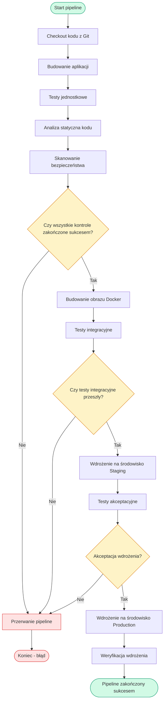

# Jenkins CI/CD Pipeline

Poniższy diagram przedstawia typowy proces CI/CD dla aplikacji webowej realizowany przy użyciu Jenkins.

```mermaid
flowchart TD
    A([Start pipeline]) --> B[Checkout kodu z Git]
    B --> C[Budowanie aplikacji]
    C --> D[Testy jednostkowe]
    D --> E[Analiza statyczna kodu]
    E --> F[Skanowanie bezpieczeństwa]

    F --> G{Czy wszystkie kontrole zakończone sukcesem?}

    G -->|Nie| H[Przerwanie pipeline]
    H --> I([Koniec - błąd])

    G -->|Tak| J[Budowanie obrazu Docker]
    J --> K[Testy integracyjne]
    K --> L{Czy testy integracyjne przeszły?}

    L -->|Nie| H
    L -->|Tak| M[Wdrożenie na środowisko Staging]

    M --> N[Testy akceptacyjne]
    N --> O{Akceptacja wdrożenia?}

    O -->|Nie| H
    O -->|Tak| P[Wdrożenie na środowisko Production]

    P --> Q[Weryfikacja wdrożenia]
    Q --> R([Pipeline zakończony sukcesem])

    style A fill:#d1fae5,stroke:#059669
    style R fill:#d1fae5,stroke:#059669
    style I fill:#fee2e2,stroke:#dc2626
    style H fill:#fee2e2,stroke:#dc2626
    style G fill:#fef3c7,stroke:#d97706
    style L fill:#fef3c7,stroke:#d97706
    style O fill:#fef3c7,stroke:#d97706
```